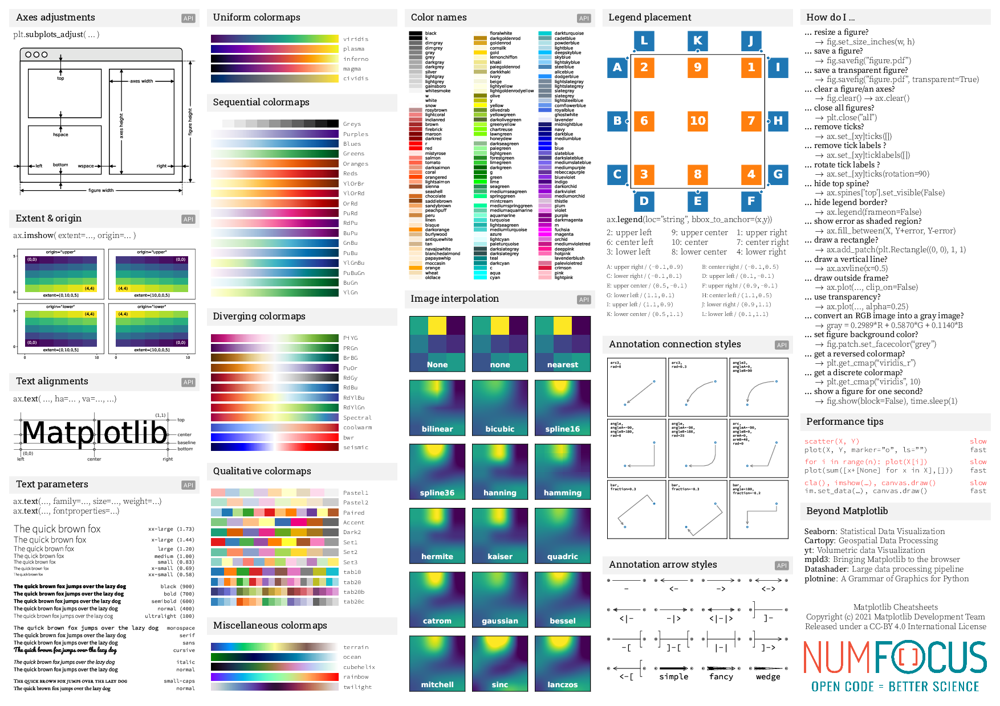

# Matplotlob
This repository records some of my practice codes. most of them are from [Quick-start guide](https://matplotlib.org/3.5.1/tutorials/introductory/usage.html)

## Cheatsheet

The official cheatsheet repository:

[matplotlib/cheatsheets](https://github.com/matplotlib/cheatsheets)

For the convenience to look up, I convert the pdf file in this repository to picture.

### Cheatsheet

### Handouts

#### Beginner handout

#### Intermediate handout

#### Tips handout

